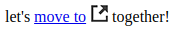
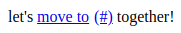

# ::after

是生成的内容元素，表示相应元素的可样式抽象的最后一个子元素。

使用`::after`插入的内容插入元素内的其他内容*之后*，默认情况下以内联方式显示。使用[`content`](http://tympanus.net/codrops/css_reference/content)属性指定内容的值。

例如，假设您要向链接到读者正在阅读的网站以外的网页上链接的所有链接添加一个小图标。通常最好添加一个小图标，告诉读者他们即将点击的链接会将他们带到另一个域。可以在链接的内容之前或之后添加这样的图标。在内容之后添加它是很常见的，这就是我们要做的事情 - 使用`::after`我们将在具有类名的页面上的所有链接的内容之后插入小图标（）`.external`。

```html
let's <a href="#" class="external">move to</a> together!
```

```css
.external::after{
    content: url("external-link.png");
    padding-left: 5px;
}
```

效果：



伪元素可用于插入几乎任何类型的内容，包括字符（如上所述），文本字符串和图像。

### 冒号的问题

您很可能会遇到（或已经遇到）`:after`使用一个冒号而不是两个冒号的符号。

在CSS1和CSS2中，伪元素被定义为以一个冒号（:)开头，就像伪类一样（例如[`:hover`](http://tympanus.net/codrops/css_reference/hover)）。在CSS3中，为伪元素引入了双冒号（::)，以便将它们与伪类区分开来。

所有支持双冒号表示法的浏览器也支持单冒号表示法。但是，Internet Explorer 8不支持双冒号表示法。因此，除非您需要支持Internet Explorer 8，否则可以使用双冒号表示法而不必担心浏览器支持。

### 访问属性

```css
.external:after{
    content: "("attr(href)")";
}
```



