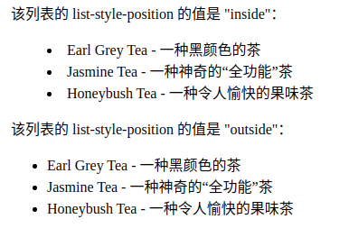

# 列表样式

以下样式适用于 ul以及列表项li。

### 设置列表标记

list-style-type属性指定列表项标记的类型

```css
 list-style-type:circle
```

| 值                   | 描述                                                        |
| :------------------- | :---------------------------------------------------------- |
| none                 | 无标记。                                                    |
| disc                 | 默认。标记是实心圆。                                        |
| circle               | 标记是空心圆。                                              |
| square               | 标记是实心方块。                                            |
| decimal              | 标记是数字。                                                |
| decimal-leading-zero | 0开头的数字标记。(01, 02, 03, 等。)                         |
| lower-roman          | 小写罗马数字(i, ii, iii, iv, v, 等。)                       |
| upper-roman          | 大写罗马数字(I, II, III, IV, V, 等。)                       |
| lower-alpha          | 小写英文字母The marker is lower-alpha (a, b, c, d, e, 等。) |
| upper-alpha          | 大写英文字母The marker is upper-alpha (A, B, C, D, E, 等。) |
| lower-greek          | 小写希腊字母(alpha, beta, gamma, 等。)                      |
| lower-latin          | 小写拉丁字母(a, b, c, d, e, 等。)                           |
| upper-latin          | 大写拉丁字母(A, B, C, D, E, 等。)                           |
| hebrew               | 传统的希伯来编号方式                                        |
| armenian             | 传统的亚美尼亚编号方式                                      |
| georgian             | 传统的乔治亚编号方式(an, ban, gan, 等。)                    |
| cjk-ideographic      | 简单的表意数字                                              |
| hiragana             | 标记是：a, i, u, e, o, ka, ki, 等。（日文片假名）           |
| katakana             | 标记是：A, I, U, E, O, KA, KI, 等。（日文片假名）           |
| hiragana-iroha       | 标记是：i, ro, ha, ni, ho, he, to, 等。（日文片假名）       |
| katakana-iroha       | 标记是：I, RO, HA, NI, HO, HE, TO, 等。（日文片假名）       |

### 图像标记

list-style-image 属性使用图像来替换列表项的标记

**注意:** 请始终规定一个 "list-style-type" 属性以防图像不可用

```css
ul{
    list-style-type: square;
    list-style-image: url("0.jpg");
}
```

### 列表中列表项标志的位置

list-style-position属性指示如何相对于对象的内容绘制列表项标记.

| 值      | 描述                                                         |
| :------ | :----------------------------------------------------------- |
| inside  | 列表项目标记放置在文本以内，且环绕文本根据标记对齐。         |
| outside | 默认值。保持标记位于文本的左侧。列表项目标记放置在文本以外，且环绕文本不根据标记对齐。 |

直观的表现就是：



