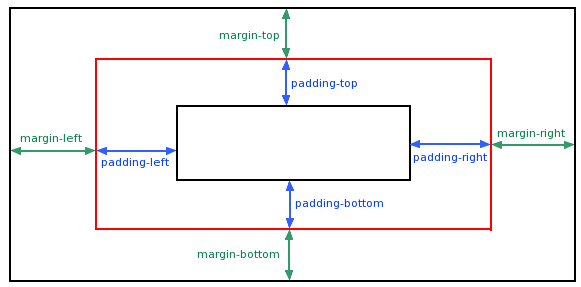

# 外边距margin与填充padding

## 外边距margin

属性定义元素周围的空间,margin 没有背景颜色，是完全透明的,可以理解为与父容器或兄弟容器的距离。

| 值       | 说明                                        |
| :------- | :------------------------------------------ |
| auto     | 设置浏览器边距。 这样做的结果会依赖于浏览器 |
| *length* | 定义一个固定的margin（使用像素，pt，em等）  |
| *%*      | 定义一个使用百分比的边距                    |

margin属性可以有一到四个值。

- margin:25px 50px 75px 100px;
  - 上边距为25px
  - 右边距为50px
  - 下边距为75px
  - 左边距为100px
- margin:25px 50px 75px;
  - 上边距为25px
  - 左右边距为50px
  - 下边距为75px
- margin:25px 50px;
  - 上下边距为25px
  - 左右边距为50px
- margin:25px;
  - 所有的4个边距都是25px

## 填充padding

容器与内容之间的距离。

| 值       | 说明                                |
| :------- | :---------------------------------- |
| *length* | 定义一个固定的填充(像素, pt, em,等) |
| *%*      | 使用百分比值定义一个填充            |

Padding属性，可以有一到四个值，与外边距类似。

